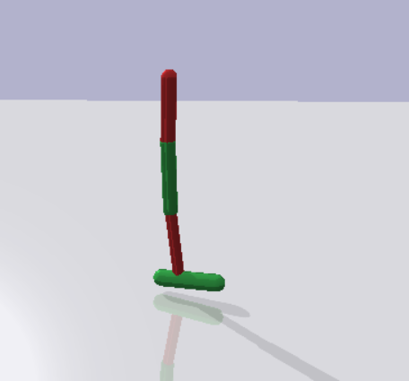

# PartiallyObservableGym This repository summarizes tasks used in DRL and defines a set of POMDP on top of them.

<table style="width: 1000px;" border="black" cellspacing="0" cellpadding="0">
<tbody>
<tr style="height: 19px;">
<td style="text-align: center; height: 37px; width: 120px;" rowspan="2"><strong>Platform</strong></td>
<td style="text-align: center; height: 37px; width: 80px;" colspan="2" rowspan="2"><strong>Task</strong></td>
<td style="height: 19px; text-align: center; width: 260px;" colspan="2"><strong>Observation</strong></td>
<td style="height: 19px; text-align: center; width: 259px;" colspan="2"><strong>Action</strong></td>
<td style="height: 37px; text-align: center; width: 69px;" rowspan="2"><strong>Reward</strong></td>
<td style="height: 37px; text-align: center; width: 200px;" colspan="1" rowspan="2"><strong>Image</strong></td>
</tr>
<tr style="height: 18px;">
<td style="height: 18px; text-align: center; width: 60px;"><strong>Dim</strong></td>
<td style="height: 18px; text-align: center; width: 200px;" rowspan="1"><strong>Composition</strong></td>
<td style="height: 18px; text-align: center; width: 60px;"><strong>Dim</strong></td>
<td style="height: 18px; text-align: center; width: 200px;" rowspan="1"><strong>Composition</strong></td>
</tr>
<tr style="height: 62px;">
<td style="height: 978.4px; width: 120px; text-align: center;" rowspan="13">&nbsp;<strong>OpenAI Gym</strong></td>
<td style="height: 978.4px; width: 100px; text-align: center;" rowspan="13">&nbsp;<strong>MuJoCo</strong></td>
<td style="height: 50px; width: 50px;"><a href="https://github.com/openai/gym/blob/master/gym/envs/mujoco/half_cheetah_v3.py" target="_blank" rel="noopener">HalfCheetah-v3</a>  <a href="https://github.com/openai/gym/blob/master/gym/envs/mujoco/half_cheetah.py" target="_blank" rel="noopener">HalfCheetah-v2</a></td>
<td style="text-align: center; height: 60px; width: 60px;">17</td>
<td style="height: 60px; padding-left: 5px; width: 200px;">

Expand

<ul>
<li>Position: 1-8 (d=8)</li>
<li>Velocity: 9-17 (d=9)</li>
</ul>

</td>
<td style="text-align: center; height: 60px; width: 69.5px;">6</td>
<td style="height: 60px; padding-left: 5px; width: 189.5px;">

Expand

</td>
<td style="height: 60px; width: 69px;">&nbsp;</td>
<td style="text-align: center; height: 60px; width: 141px;"></td>
</tr>
<tr style="height: 58.4px;">
<td style="height: 50px; width: 50px;"><a href="https://github.com/openai/gym/blob/master/gym/envs/mujoco/ant_v3.py" target="_blank" rel="noopener">Ant-v3</a> <a href="https://github.com/openai/gym/blob/master/gym/envs/mujoco/ant.py" target="_blank" rel="noopener">Ant-v2</a></td>
<td style="text-align: center; height: 60px; width: 60px;">111</td>
<td style="height: 60px; padding-left: 5px; width: 200px;">

Expand

<ul>
<li>position: 1-13 (d=13)</li>
<li>velocity: 14-27 (d=14)</li>
<li>cfrc_ext: 28-111 (d=64)</li>
</ul>

</td>
<td style="text-align: center; height: 60px; width: 69.5px;">8</td>
<td style="height: 60px; padding-left: 5px; width: 189.5px;">

Expand

</td>
<td style="height: 60px; width: 69px;">&nbsp;</td>
<td style="text-align: center; height: 60px; width: 141px;"></td>
</tr>
<tr style="height: 78px;">
<td style="height: 50px; width: 50px;"><a href="https://github.com/openai/gym/blob/master/gym/envs/mujoco/walker2d_v3.py" target="_blank" rel="noopener">Walker2d-v3</a>  <a href="https://github.com/openai/gym/blob/master/gym/envs/mujoco/walker2d.py" target="_blank" rel="noopener">Walker2d-v2</a></td>
<td style="text-align: center; height: 60px; width: 60px;">17</td>
<td style="height: 60px; padding-left: 5px; width: 200px;">

Expand

<ul>
<li>position: 1-8 (d=8)</li>
<li>velocity: 9-17 (d=9)</li>
</ul>

</td>
<td style="text-align: center; height: 60px; width: 69.5px;">6</td>
<td style="height: 60px; padding-left: 5px; width: 189.5px;">

Expand

</td>
<td style="height: 60px; width: 69px;">&nbsp;</td>
<td style="text-align: center; height: 60px; width: 141px;"></td>
</tr>
<tr style="height: 78px;">
<td style="height: 50px; width: 50px;"><a href="https://github.com/openai/gym/blob/master/gym/envs/mujoco/hopper_v3.py" target="_blank" rel="noopener">Hopper-v3</a>  <a href="http://localhost:8888/notebooks/Google%20Drive/git_repos/spinningup-new/spinup/algos/pytorch/lstm_ddpg/Untitled2.ipynb" target="_blank" rel="noopener">Hopper-v2</a></td>
<td style="text-align: center; height: 60px; width: 60px;">11</td>
<td style="height: 60px; padding-left: 5px; width: 200px;">

Expand

<ul>
<li>position: 1-5 (d=5)</li>
<li>velocity: 6-11 (d=6)</li>
</ul>

</td>
<td style="text-align: center; height: 60px; width: 69.5px;">3</td>
<td style="height: 60px; padding-left: 5px; width: 189.5px;">

Expand

</td>
<td style="height: 60px; width: 69px;">&nbsp;</td>
<td style="text-align: center; height: 60px; width: 141px;"></td>
</tr>
<tr style="height: 78px;">
<td style="height: 50px; width: 50px;"><a href="https://github.com/openai/gym/blob/master/gym/envs/mujoco/inverted_pendulum.py" target="_blank" rel="noopener">InvertedPendulum-v2</a></td>
<td style="text-align: center; height: 60px; width: 60px;">4</td>
<td style="height: 60px; padding-left: 5px; width: 200px;">

Expand

<ul>
<li>position: 1-2 (d=2)</li>
<li>velocity: 3-4 (d=2)</li>
</ul>

</td>
<td style="text-align: center; height: 60px; width: 69.5px;">1</td>
<td style="height: 60px; padding-left: 5px; width: 189.5px;">

Expand

</td>
<td style="height: 60px; width: 69px;">&nbsp;</td>
<td style="text-align: center; height: 60px; width: 141px;"></td>
</tr>
<tr style="height: 78px;">
<td style="height: 50px; width: 50px;"><a href="https://github.com/openai/gym/blob/master/gym/envs/mujoco/inverted_double_pendulum.py" target="_blank" rel="noopener">InvertedDoublePendulum-v2</a></td>
<td style="text-align: center; height: 60px; width: 60px;">11</td>
<td style="height: 60px; padding-left: 5px; width: 200px;">

Expand

<ul>
<li>cart position: 1</li>
<li>link angles sin: 2-3</li>
<li>link angles cos: 4-5</li>
<li>link velocity: 6-8 (d=3)</li>
<li>qfrc_constraint: 9-11 (d=3)</li>
</ul>

</td>
<td style="text-align: center; height: 60px; width: 69.5px;">1</td>
<td style="height: 60px; padding-left: 5px; width: 189.5px;">

Expand

&nbsp;</td>
<td style="height: 60px; width: 69px;">&nbsp;</td>
<td style="text-align: center; height: 60px; width: 141px;"></td>
</tr>
<tr style="height: 78px;">
<td style="height: 50px; width: 50px;"><a href="https://github.com/openai/gym/blob/master/gym/envs/mujoco/swimmer_v3.py" target="_blank" rel="noopener">Swimmer-v3</a>  <a href="https://github.com/openai/gym/blob/master/gym/envs/mujoco/walker2d.py" target="_blank" rel="noopener">Swimmer-v2</a></td>
<td style="text-align: center; height: 60px; width: 60px;">8</td>
<td style="height: 60px; padding-left: 5px; width: 200px;">

Expand

<ul>
<li>position: 1-3 (d=3)</li>
<li>velocity: 4-8 (d=5)</li>
</ul>

</td>
<td style="text-align: center; height: 60px; width: 69.5px;">2</td>
<td style="height: 60px; padding-left: 5px; width: 189.5px;">

Expand

</td>
<td style="height: 60px; width: 69px;">&nbsp;</td>
<td style="text-align: center; height: 60px; width: 141px;"></td>
</tr>
<tr style="height: 78px;">
<td style="height: 50px; width: 50px;"><a href="https://github.com/openai/gym/blob/master/gym/envs/mujoco/thrower.py" target="_blank" rel="noopener">Thrower-v2</a></td>
<td style="text-align: center; height: 60px; width: 60px;">23</td>
<td style="height: 60px; padding-left: 5px; width: 200px;">

Expand

<ul>
<li>position: 1-7 (d=7)</li>
<li>velocity: 8-14 (d=7)</li>
<li>get_body_com("r_wrist_roll_link"): 15-17 (d=3)</li>
<li>get_body_com("ball"): 18-20 (d=3)</li>
<li>get_body_com("goal"): 21-23 (d=3)</li>
</ul>

</td>
<td style="text-align: center; height: 60px; width: 69.5px;">7</td>
<td style="height: 60px; padding-left: 5px; width: 189.5px;">

Expand

</td>
<td style="height: 60px; width: 69px;">&nbsp;</td>
<td style="text-align: center; height: 60px; width: 141px;"></td>
</tr>
<tr style="height: 78px;">
<td style="height: 50px; width: 50px;"><a href="https://github.com/openai/gym/blob/master/gym/envs/mujoco/striker.py" target="_blank" rel="noopener">Striker-v2</a></td>
<td style="text-align: center; height: 60px; width: 60px;">23</td>
<td style="height: 60px; padding-left: 5px; width: 200px;">

Expand

<ul>
<li>position: 1-7 (d=7)</li>
<li>velocity: 8-14 (d=7)</li>
<li>get_body_com("tips_arm"): 15-17 (d=3)</li>
<li>get_body_com("object"): 18-20 (d=3)</li>
<li>get_body_com("goal"): 21-23 (d=3)</li>
</ul>

</td>
<td style="text-align: center; height: 60px; width: 69.5px;">7</td>
<td style="height: 60px; padding-left: 5px; width: 189.5px;">

Expand

</td>
<td style="height: 60px; width: 69px;">&nbsp;</td>
<td style="text-align: center; height: 60px; width: 141px;"></td>
</tr>
<tr style="height: 78px;">
<td style="height: 50px; width: 50px;"><a href="https://github.com/openai/gym/blob/master/gym/envs/mujoco/pusher.py" target="_blank" rel="noopener">Pusher-v2</a></td>
<td style="text-align: center; height: 60px; width: 60px;">23</td>
<td style="height: 60px; padding-left: 5px; width: 200px;">

Expand

<ul>
<li>position: 1-7 (d=7)</li>
<li>velocity: 8-14 (d=7)</li>
<li>get_body_com("tips_arm"): 15-17 (d=3)</li>
<li>get_body_com("object"): 18-20 (d=3)</li>
<li>get_body_com("goal"): 21-23 (d=3)</li>
</ul>

</td>
<td style="text-align: center; height: 60px; width: 69.5px;">7</td>
<td style="height: 60px; padding-left: 5px; width: 189.5px;">

Expand

</td>
<td style="height: 60px; width: 69px;">&nbsp;</td>
<td style="text-align: center; height: 60px; width: 141px;"></td>
</tr>
<tr style="height: 78px;">
<td style="height: 50px; width: 50px;"><a href="https://github.com/openai/gym/blob/master/gym/envs/mujoco/reacher.py" target="_blank" rel="noopener">Reacher-v2</a></td>
<td style="text-align: center; height: 60px; width: 60px;">11</td>
<td style="height: 60px; padding-left: 5px; width: 200px;">

Expand

<ul>
<li>cos: 1-2 (d=2)</li>
<li>sin: 3-4 (d=2)</li>
<li>position: 5-6 (d=2)</li>
<li>velocity: 7-8 (d=2)</li>
<li>get_body_com("fingertip")-get_body_com("target"): 9-11 (d=3)</li>
</ul>

</td>
<td style="text-align: center; height: 60px; width: 69.5px;">2</td>
<td style="height: 60px; padding-left: 5px; width: 189.5px;">

Expand

</td>
<td style="height: 60px; width: 69px;">&nbsp;</td>
<td style="text-align: center; height: 60px; width: 141px;"></td>
</tr>
<tr style="height: 78px;">
<td style="height: 50px; width: 50px;"><a href="https://github.com/openai/gym/blob/master/gym/envs/mujoco/humanoid_v3.py" target="_blank" rel="noopener">Humanoid-v3</a>  <a href="https://github.com/openai/gym/blob/master/gym/envs/mujoco/humanoid.py" target="_blank" rel="noopener">Humanoid-v2</a></td>
<td style="text-align: center; height: 60px; width: 60px;">376</td>
<td style="height: 60px; padding-left: 5px; width: 200px;">

Expand

<ul>
<li>position: 1-22 (d=22)</li>
<li>velocity: 23-45 (d=23)</li>
<li>com_inertia: 46-185 (d=140)</li>
<li>com_velocity: 186-269 (d=84)</li>
<li>actuator_forces: 270-292 (d=23)</li>
<li>external_contact_forces: 293-376 (d=84)</li>
</ul>

</td>
<td style="text-align: center; height: 60px; width: 69.5px;">6</td>
<td style="height: 60px; padding-left: 5px; width: 189.5px;">

Expand

&nbsp;</td>
<td style="height: 60px; width: 69px;">&nbsp;</td>
<td style="text-align: center; height: 60px; width: 141px;"></td>
</tr>
<tr style="height: 78px;">
<td style="height: 50px; width: 50px;"><a href="https://github.com/openai/gym/blob/master/gym/envs/mujoco/humanoidstandup.py" target="_blank" rel="noopener">HumanoidStandup-v2</a></td>
<td style="text-align: center; height: 60px; width: 60px;">376</td>
<td style="height: 60px; padding-left: 5px; width: 200px;">

Expand

<ul>
<li>position: 1-22 (d=22)</li>
<li>velocity: 23-45 (d=23)</li>
<li>com_inertia: 46-185 (d=140)</li>
<li>com_velocity: 186-269 (d=84)</li>
<li>actuator_forces: 270-292 (d=23)</li>
<li>external_contact_forces: 293-376 (d=84)</li>
</ul>

</td>
<td style="text-align: center; height: 60px; width: 69.5px;">17</td>
<td style="height: 60px; padding-left: 5px; width: 189.5px;">

Expand

&nbsp;</td>
<td style="height: 60px; width: 69px;">&nbsp;</td>
<td style="text-align: center; height: 60px; width: 141px;"></td>
</tr>
<tr style="height: 78px;">
<td style="height: 1716px; width: 120px; text-align: center;" rowspan="22">&nbsp;<strong>PyBulletGym</strong></td>
<td style="height: 1170px; width: 100px; text-align: center;" rowspan="15">&nbsp;<strong>RoboSchool Envs</strong></td>
<td style="height: 50px; width: 50px;"><a href="https://github.com/benelot/pybullet-gym/blob/master/pybulletgym/envs/roboschool/robots/locomotors/walker_base.py" target="_blank" rel="noopener">HalfCheetahPyBulletEnv-v0</a></td>
<td style="text-align: center; height: 60px; width: 60px;">26</td>
<td style="height: 60px; padding-left: 5px; width: 200px;">

Expand

<ul>
<li>more: (d=8)
<ul>
<li>distance at z: 1</li>
<li>angle_to_target sin: 2</li>
<li>angle_to_target cos: 3</li>
<li>velocity x: 4</li>
<li>velocity y: 5</li>
<li>velocity z: 6</li>
<li>roll: 7</li>
<li>pitch: 8</li>
</ul>
</li>
<li>position: 9-20 (d=12)</li>
<li>feet contact: 21-26 (d=6)</li>
</ul>

</td>
<td style="text-align: center; height: 60px; width: 69.5px;">6</td>
<td style="height: 60px; padding-left: 5px; width: 189.5px;">

Expand

</td>
<td style="height: 60px; width: 69px;">&nbsp;</td>
<td style="text-align: center; height: 60px; width: 141px;"></td>
</tr>
<tr style="height: 78px;">
<td style="height: 50px; width: 50px;"><a href="http://localhost:8888/notebooks/Google%20Drive/git_repos/spinningup-new/spinup/algos/pytorch/lstm_ddpg/Untitled2.ipynb" target="_blank" rel="noopener">AntPyBulletEnv-v0</a></td>
<td style="text-align: center; height: 60px; width: 60px;">28</td>
<td style="height: 60px; padding-left: 5px; width: 200px;">

Expand

<ul>
<li>more: (d=8)
<ul>
<li>distance at z: 1</li>
<li>angle_to_target sin: 2</li>
<li>angle_to_target cos: 3</li>
<li>velocity x: 4</li>
<li>velocity y: 5</li>
<li>velocity z: 6</li>
<li>roll: 7</li>
<li>pitch: 8</li>
</ul>
</li>
<li>position: 9-24 (d=16)</li>
<li>feet contact: 25-28 (d=4)</li>
</ul>

</td>
<td style="text-align: center; height: 60px; width: 69.5px;">8</td>
<td style="height: 60px; padding-left: 5px; width: 189.5px;">

Expand

</td>
<td style="height: 60px; width: 69px;">&nbsp;</td>
<td style="text-align: center; height: 60px; width: 141px;"></td>
</tr>
<tr style="height: 78px;">
<td style="height: 50px; width: 50px;"><a href="http://localhost:8888/notebooks/Google%20Drive/git_repos/spinningup-new/spinup/algos/pytorch/lstm_ddpg/Untitled2.ipynb" target="_blank" rel="noopener">Walker2DPyBulletEnv-v0</a></td>
<td style="text-align: center; height: 60px; width: 60px;">22</td>
<td style="height: 60px; padding-left: 5px; width: 200px;">

Expand

<ul>
<li>&nbsp;more: (d=8)
<ul>
<li>distance at z: 1</li>
<li>angle_to_target sin: 2</li>
<li>angle_to_target cos: 3</li>
<li>velocity x: 4</li>
<li>velocity y: 5</li>
<li>velocity z: 6</li>
<li>roll: 7</li>
<li>pitch: 8</li>
</ul>
</li>
<li>position: 9-20 (d=12)</li>
<li>feet contact: 21-22 (d=2)</li>
</ul>

</td>
<td style="text-align: center; height: 60px; width: 69.5px;">6</td>
<td style="height: 60px; padding-left: 5px; width: 189.5px;">

Expand

</td>
<td style="height: 60px; width: 69px;">&nbsp;</td>
<td style="text-align: center; height: 60px; width: 141px;"></td>
</tr>
<tr style="height: 78px;">
<td style="height: 50px; width: 50px;"><a href="http://localhost:8888/notebooks/Google%20Drive/git_repos/spinningup-new/spinup/algos/pytorch/lstm_ddpg/Untitled2.ipynb" target="_blank" rel="noopener">HopperPyBulletEnv-v0</a></td>
<td style="text-align: center; height: 60px; width: 60px;">15</td>
<td style="height: 60px; padding-left: 5px; width: 200px;">

Expand

<ul>
<li>more: (d=8)
<ul>
<li>distance at z: 1</li>
<li>angle_to_target sin: 2</li>
<li>angle_to_target cos: 3</li>
<li>velocity x: 4</li>
<li>velocity y: 5</li>
<li>velocity z: 6</li>
<li>roll: 7</li>
<li>pitch: 8</li>
</ul>
</li>
<li>position: 9-14 (d=6)</li>
<li>feet contact: 15 (d=1)</li>
</ul>

</td>
<td style="text-align: center; height: 60px; width: 69.5px;">3</td>
<td style="height: 60px; padding-left: 5px; width: 189.5px;">

Expand

&nbsp;</td>
<td style="height: 60px; width: 69px;">&nbsp;</td>
<td style="text-align: center; height: 60px; width: 141px;"></td>
</tr>
<tr style="height: 78px;">
<td style="height: 50px; width: 50px;"><a href="https://github.com/benelot/pybullet-gym/blob/master/pybulletgym/envs/roboschool/robots/pendula/interted_pendulum.py" target="_blank" rel="noopener">InvertedPendulumPyBulletEnv-v0</a></td>
<td style="text-align: center; height: 60px; width: 60px;">5</td>
<td style="height: 60px; padding-left: 5px; width: 200px;">

Expand

<ul>
<li>slider x: 1</li>
<li>slider velocity x: 2</li>
<li>cos: 3</li>
<li>sin: 4</li>
<li>theta_dot: 5</li>
</ul>

</td>
<td style="text-align: center; height: 60px; width: 69.5px;">1</td>
<td style="height: 60px; padding-left: 5px; width: 189.5px;">

Expand

</td>
<td style="height: 60px; width: 69px;">&nbsp;</td>
<td style="text-align: center; height: 60px; width: 141px;"></td>
</tr>
<tr style="height: 78px;">
<td style="height: 50px; width: 50px;"><a href="https://github.com/benelot/pybullet-gym/blob/master/pybulletgym/envs/roboschool/robots/pendula/inverted_double_pendulum.py" target="_blank" rel="noopener">InvertedDoublePendulumPyBulletEnv-v0</a></td>
<td style="text-align: center; height: 60px; width: 60px;">9</td>
<td style="height: 60px; padding-left: 5px; width: 200px;">

Expand

<ul>
<li>slider x: 1</li>
<li>slider velocity x: 2</li>
<li>pole2 x: 3</li>
<li>j1 cos: 4</li>
<li>j1 sin: 5</li>
<li>j1 dot: 6</li>
<li>j2 cos: 7</li>
<li>j2 sin: 8</li>
<li>j2 dot: 9</li>
</ul>

</td>
<td style="text-align: center; height: 60px; width: 69.5px;">1</td>
<td style="height: 60px; padding-left: 5px; width: 189.5px;">

Expand

</td>
<td style="height: 60px; width: 69px;">&nbsp;</td>
<td style="text-align: center; height: 60px; width: 141px;"></td>
</tr>
<tr style="height: 78px;">
<td style="height: 50px; width: 50px;"><a href="https://github.com/benelot/pybullet-gym/blob/master/pybulletgym/envs/roboschool/robots/pendula/inverted_double_pendulum.py" target="_blank" rel="noopener">InvertedPendulumSwingupPyBulletEnv-v0</a></td>
<td style="text-align: center; height: 60px; width: 60px;">5</td>
<td style="height: 60px; padding-left: 5px; width: 200px;">

Expand

<ul>
<li>slider x: 1</li>
<li>slider velocity x: 2</li>
<li>cos: 3</li>
<li>sin: 4</li>
<li>theta_dot: 5</li>
</ul>

</td>
<td style="text-align: center; height: 60px; width: 69.5px;">1</td>
<td style="height: 60px; padding-left: 5px; width: 189.5px;">

Expand

</td>
<td style="height: 60px; width: 69px;">&nbsp;</td>
<td style="text-align: center; height: 60px; width: 141px;"></td>
</tr>
<tr style="height: 78px;">
<td style="height: 50px; width: 50px;"><a href="https://github.com/benelot/pybullet-gym/blob/master/pybulletgym/envs/roboschool/robots/manipulators/reacher.py" target="_blank" rel="noopener">ReacherPyBulletEnv-v0</a></td>
<td style="text-align: center; height: 60px; width: 60px;">9</td>
<td style="height: 60px; padding-left: 5px; width: 200px;">

Expand

<ul>
<li>target x: 1</li>
<li>target y: 2</li>
<li>to_target_vec 1: 3</li>
<li>to_target_vec 2: 4</li>
<li>central_joint cos: 5</li>
<li>central_joint sin: 6</li>
<li>central_joint dot: 7</li>
<li>elbow_joint gamma: 8</li>
<li>elbow_joint gamma dot: 9</li>
</ul>

</td>
<td style="text-align: center; height: 60px; width: 69.5px;">2</td>
<td style="height: 60px; padding-left: 5px; width: 189.5px;">

Expand

&nbsp;</td>
<td style="height: 60px; width: 69px;">&nbsp;</td>
<td style="text-align: center; height: 60px; width: 141px;"></td>
</tr>
<tr style="height: 78px;">
<td style="height: 50px; width: 50px;"><a href="https://github.com/benelot/pybullet-gym/blob/master/pybulletgym/envs/roboschool/robots/manipulators/pusher.py">PusherPyBulletEnv-v0</a></td>
<td style="text-align: center; height: 60px; width: 60px;">55</td>
<td style="height: 60px; padding-left: 5px; width: 200px;">

Expand

<ul>
<li>Position: (d=22)</li>
<li>Velocity: (d=22)</li>
<li>target_pos - object_pos: (d=2)</li>
<li>fingertip.pose().xyz(): (d=3)</li>
<li>object.pose().xyz(): (d=3)</li>
<li>target.pose().xyz(): (d=3)</li>
</ul>

</td>
<td style="text-align: center; height: 60px; width: 69.5px;">7</td>
<td style="height: 60px; padding-left: 5px; width: 189.5px;">

Expand

&nbsp;</td>
<td style="height: 60px; width: 69px;">&nbsp;</td>
<td style="text-align: center; height: 60px; width: 141px;"></td>
</tr>
<tr style="height: 78px;">
<td style="height: 50px; width: 50px;"><a href="https://github.com/benelot/pybullet-gym/blob/master/pybulletgym/envs/roboschool/robots/manipulators/striker.py">StrikerPyBulletEnv-v0</a></td>
<td style="text-align: center; height: 60px; width: 60px;">&nbsp;56</td>
<td style="height: 60px; padding-left: 5px; width: 200px;">

Expand

<ul>
<li>Position: (d=22)</li>
<li>Velocity: (d=22)</li>
<li>target_pos - object_pos: (d=3)</li>
<li>fingertip.pose().xyz(): (d=3)</li>
<li>object.pose().xyz(): (d=3)</li>
<li>target.pose().xyz(): (d=3)</li>
</ul>

</td>
<td style="text-align: center; height: 60px; width: 69.5px;">7</td>
<td style="height: 60px; padding-left: 5px; width: 189.5px;">

Expand

&nbsp;</td>
<td style="height: 60px; width: 69px;">&nbsp;</td>
<td style="text-align: center; height: 60px; width: 141px;"></td>
</tr>
<tr style="height: 78px;">
<td style="height: 50px; width: 50px;"><a href="https://github.com/benelot/pybullet-gym/blob/master/pybulletgym/envs/roboschool/robots/manipulators/thrower.py">ThrowerPyBulletEnv-v0</a></td>
<td style="text-align: center; height: 60px; width: 60px;">&nbsp;48</td>
<td style="height: 60px; padding-left: 5px; width: 200px;">

Expand

<ul>
<li>Position: (d=18)</li>
<li>Velocity: (d=18)</li>
<li>target_pos - object_pos: (d=3)</li>
<li>fingertip.pose().xyz(): (d=3)</li>
<li>object.pose().xyz(): (d=3)</li>
<li>target.pose().xyz(): (d=3)</li>
</ul>

</td>
<td style="text-align: center; height: 60px; width: 69.5px;">7</td>
<td style="height: 60px; padding-left: 5px; width: 189.5px;">

Expand

&nbsp;</td>
<td style="height: 60px; width: 69px;">&nbsp;</td>
<td style="text-align: center; height: 60px; width: 141px;"></td>
</tr>
<tr style="height: 78px;">
<td style="height: 50px; width: 50px;"><a href="https://github.com/benelot/pybullet-gym/blob/master/pybulletgym/envs/roboschool/robots/locomotors/humanoid.py">HumanoidPyBulletEnv-v0</a></td>
<td style="text-align: center; height: 60px; width: 60px;">44</td>
<td style="height: 60px; padding-left: 5px; width: 200px;">

Expand

<ul>
<li>more: (d=8)
<ul>
<li>distance at z: 1</li>
<li>angle_to_target sin: 2</li>
<li>angle_to_target cos: 3</li>
<li>velocity x: 4</li>
<li>velocity y: 5</li>
<li>velocity z: 6</li>
<li>roll: 7</li>
<li>pitch: 8</li>
</ul>
</li>
<li>position: 9-42 (d=34)</li>
<li>feet contact: 43-44 (d=2)</li>
</ul>

</td>
<td style="text-align: center; height: 60px; width: 69.5px;">17</td>
<td style="height: 60px; padding-left: 5px; width: 189.5px;">

Expand

&nbsp;</td>
<td style="height: 60px; width: 69px;">&nbsp;</td>
<td style="text-align: center; height: 60px; width: 141px;"></td>
</tr>
<tr style="height: 78px;">
<td style="height: 50px; width: 50px;"><a href="https://github.com/benelot/pybullet-gym/blob/master/pybulletgym/envs/roboschool/robots/locomotors/humanoid_flagrun.py">HumanoidFlagrunPyBulletEnv-v0</a></td>
<td style="text-align: center; height: 60px; width: 60px;">44</td>
<td style="height: 60px; padding-left: 5px; width: 200px;">

Expand

<ul>
<li>more: (d=8)
<ul>
<li>distance at z: 1</li>
<li>angle_to_target sin: 2</li>
<li>angle_to_target cos: 3</li>
<li>velocity x: 4</li>
<li>velocity y: 5</li>
<li>velocity z: 6</li>
<li>roll: 7</li>
<li>pitch: 8</li>
</ul>
</li>
<li>position: 9-42 (d=34)</li>
<li>feet contact: 43-44 (d=2)</li>
</ul>

</td>
<td style="text-align: center; height: 60px; width: 69.5px;">&nbsp;17</td>
<td style="height: 60px; padding-left: 5px; width: 189.5px;">

Expand

&nbsp;</td>
<td style="height: 60px; width: 69px;">&nbsp;</td>
<td style="text-align: center; height: 60px; width: 141px;"></td>
</tr>
<tr style="height: 78px;">
<td style="height: 50px; width: 50px;"><a href="https://github.com/benelot/pybullet-gym/blob/master/pybulletgym/envs/roboschool/robots/locomotors/humanoid_flagrun.py">HumanoidFlagrunHarderPyBulletEnv-v0</a></td>
<td style="text-align: center; height: 60px; width: 60px;">44</td>
<td style="height: 60px; padding-left: 5px; width: 200px;">

Expand

<ul>
<li>more: (d=8)
<ul>
<li>distance at z: 1</li>
<li>angle_to_target sin: 2</li>
<li>angle_to_target cos: 3</li>
<li>velocity x: 4</li>
<li>velocity y: 5</li>
<li>velocity z: 6</li>
<li>roll: 7</li>
<li>pitch: 8</li>
</ul>
</li>
<li>position: 9-42 (d=34)</li>
<li>feet contact: 43-44 (d=2)</li>
</ul>

</td>
<td style="text-align: center; height: 60px; width: 69.5px;">17</td>
<td style="height: 60px; padding-left: 5px; width: 189.5px;">

Expand

&nbsp;</td>
<td style="height: 60px; width: 69px;">&nbsp;</td>
<td style="text-align: center; height: 60px; width: 141px;"></td>
</tr>
<tr style="height: 78px;">
<td style="height: 50px; width: 50px;"><a href="https://github.com/benelot/pybullet-gym/blob/master/pybulletgym/envs/roboschool/robots/locomotors/atlas.py">AtlasPyBulletEnv-v0</a></td>
<td style="text-align: center; height: 60px; width: 60px;">70</td>
<td style="height: 60px; padding-left: 5px; width: 200px;">

Expand

<ul>
<li>more: (d=8)
<ul>
<li>distance at z: 1</li>
<li>angle_to_target sin: 2</li>
<li>angle_to_target cos: 3</li>
<li>velocity x: 4</li>
<li>velocity y: 5</li>
<li>velocity z: 6</li>
<li>roll: 7</li>
<li>pitch: 8</li>
</ul>
</li>
<li>position: 9-68 (d=60)</li>
<li>feet contact: 69-70 (d=2)</li>
</ul>

</td>
<td style="text-align: center; height: 60px; width: 69.5px;">30&nbsp;</td>
<td style="height: 60px; padding-left: 5px; width: 189.5px;">&nbsp;</td>
<td style="height: 60px; width: 69px;">&nbsp;</td>
<td style="text-align: center; height: 60px; width: 141px;">&nbsp;</td>
</tr>
<tr style="height: 78px;">
<td style="text-align: center; height: 546px; width: 100px;" rowspan="7">&nbsp;<strong>MuJoCo Envs</strong></td>
<td style="height: 50px; width: 50px;"><a href="https://github.com/benelot/pybullet-gym/blob/master/pybulletgym/envs/mujoco/robots/locomotors/half_cheetah.py" target="_blank" rel="noopener">HalfCheetahMuJoCoEnv-v0</a>&nbsp;</td>
<td style="text-align: center; height: 60px; width: 60px;">17</td>
<td style="height: 60px; padding-left: 5px; width: 200px;">

Expand

<ul>
<li>&nbsp;position: 1-8 (d=8)</li>
<li>velocity: 9-17 (d=9)</li>
</ul>

</td>
<td style="text-align: center; height: 60px; width: 69.5px;">6</td>
<td style="height: 60px; padding-left: 5px; width: 189.5px;">

Expand

&nbsp;</td>
<td style="height: 60px; width: 69px;">&nbsp;</td>
<td style="text-align: center; height: 60px; width: 141px;"></td>
</tr>
<tr style="height: 78px;">
<td style="height: 50px; width: 50px;"><a href="https://github.com/benelot/pybullet-gym/blob/master/pybulletgym/envs/mujoco/robots/locomotors/ant.py" target="_blank" rel="noopener">AntMuJoCoEnv-v0</a>&nbsp;</td>
<td style="text-align: center; height: 60px; width: 60px;">111</td>
<td style="height: 60px; padding-left: 5px; width: 200px;">

Expand

<ul>
<li>position: 1-13 (d=13)</li>
<li>velocity: 14-27 (d=14)</li>
<li>cfrc_ext: 28-111 (d=64) (The cfrc_ext is set to zeros in PyBulletGym.) (The cfrc_ext are the external forces (force x,y,z and torque x,y,z) applied to each of the links at the center of mass. For the Ant, this is 14*6: the ground link, the torso link, and 12 links for all legs (3 links for each leg))</li>
</ul>

</td>
<td style="text-align: center; height: 60px; width: 69.5px;">8</td>
<td style="height: 60px; padding-left: 5px; width: 189.5px;">

Expand

&nbsp;</td>
<td style="height: 60px; width: 69px;">&nbsp;</td>
<td style="text-align: center; height: 60px; width: 141px;"></td>
</tr>
<tr style="height: 78px;">
<td style="height: 50px; width: 50px;"><a href="https://github.com/benelot/pybullet-gym/blob/master/pybulletgym/envs/mujoco/robots/locomotors/walker2d.py" target="_blank" rel="noopener">Walker2DMuJoCoEnv-v0</a></td>
<td style="text-align: center; height: 60px; width: 60px;">17</td>
<td style="height: 60px; padding-left: 5px; width: 200px;">

Expand

<ul>
<li>position: 1-8 (d=8)</li>
<li>velocity: 9-17 (d=9)</li>
</ul>

</td>
<td style="text-align: center; height: 60px; width: 69.5px;">6</td>
<td style="height: 60px; padding-left: 5px; width: 189.5px;">

Expand

&nbsp;</td>
<td style="height: 60px; width: 69px;">&nbsp;</td>
<td style="text-align: center; height: 60px; width: 141px;"></td>
</tr>
<tr style="height: 78px;">
<td style="height: 50px; width: 50px;"><a href="https://github.com/benelot/pybullet-gym/blob/master/pybulletgym/envs/mujoco/robots/locomotors/hopper.py" target="_blank" rel="noopener">HopperMuJoCoEnv-v0</a></td>
<td style="text-align: center; height: 60px; width: 60px;">15</td>
<td style="height: 60px; padding-left: 5px; width: 200px;">

Expand

<ul>
<li>position: 1-7 (d=7)</li>
<li>velocity: 8-15 (d=8)</li>
</ul>

</td>
<td style="text-align: center; height: 60px; width: 69.5px;">3</td>
<td style="height: 60px; padding-left: 5px; width: 189.5px;">

Expand

&nbsp;</td>
<td style="height: 60px; width: 69px;">&nbsp;</td>
<td style="text-align: center; height: 60px; width: 141px;"></td>
</tr>
<tr style="height: 78px;">
<td style="height: 50px; width: 50px;"><a href="https://github.com/benelot/pybullet-gym/blob/master/pybulletgym/envs/mujoco/robots/pendula/inverted_pendulum.py" target="_blank" rel="noopener">InvertedPendulumMuJoCoEnv-v0</a></td>
<td style="text-align: center; height: 60px; width: 60px;">4</td>
<td style="height: 60px; padding-left: 5px; width: 200px;">

Expand

<ul>
<li>position: 1-3 (d=3)</li>
<li>velocity: 4 (d=1)</li>
</ul>

</td>
<td style="text-align: center; height: 60px; width: 69.5px;">1</td>
<td style="height: 60px; padding-left: 5px; width: 189.5px;">

Expand

&nbsp;</td>
<td style="height: 60px; width: 69px;">&nbsp;</td>
<td style="text-align: center; height: 60px; width: 141px;"></td>
</tr>
<tr style="height: 78px;">
<td style="height: 50px; width: 50px;"><a href="https://github.com/benelot/pybullet-gym/blob/master/pybulletgym/envs/mujoco/robots/pendula/inverted_double_pendulum.py" target="_blank" rel="noopener">InvertedDoublePendulumMuJoCoEnv-v0</a></td>
<td style="text-align: center; height: 60px; width: 60px;">11</td>
<td style="height: 60px; padding-left: 5px; width: 200px;">

Expand

<ul>
<li>cart position: 1</li>
<li>link angles sin: 2-3</li>
<li>link angles cos: 4-5</li>
<li>link velocity: 6-8</li>
<li>qfrc_constraint: 9-11</li>
</ul>

</td>
<td style="text-align: center; height: 60px; width: 69.5px;">1</td>
<td style="height: 60px; padding-left: 5px; width: 189.5px;">

Expand

&nbsp;</td>
<td style="height: 60px; width: 69px;">&nbsp;</td>
<td style="text-align: center; height: 60px; width: 141px;"></td>
</tr>
<tr style="height: 78px;">
<td style="height: 50px; width: 50px;"><a href="https://github.com/benelot/pybullet-gym/blob/master/pybulletgym/envs/mujoco/robots/locomotors/humanoid.py">HumanoidMuJoCoEnv-v0</a></td>
<td style="text-align: center; height: 60px; width: 60px;">376</td>
<td style="height: 60px; padding-left: 5px; width: 200px;">

Expand

<ul>
<li>position: 1-22 (d=22)</li>
<li>velocity: 23-45 (d=23)</li>
<li>com_inertia: 46-185 (d=140)</li>
<li>com_velocity: 186-269 (d=84)</li>
<li>actuator_forces: 270-292 (d=23)</li>
<li>external_contact_forces: 293-376 (d=84)</li>
</ul>

</td>
<td style="text-align: center; height: 60px; width: 69.5px;">17</td>
<td style="height: 60px; padding-left: 5px; width: 189.5px;">

Expand

&nbsp;</td>
<td style="height: 60px; width: 69px;">&nbsp;</td>
<td style="text-align: center; height: 60px; width: 141px;"></td>
</tr>
</tbody>
</table>

